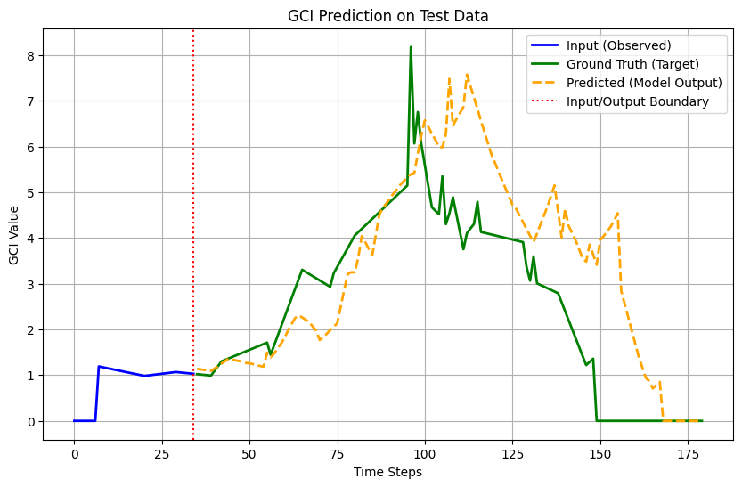
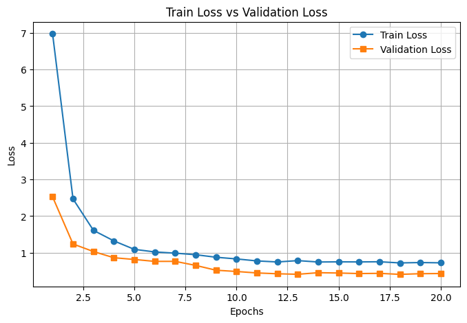
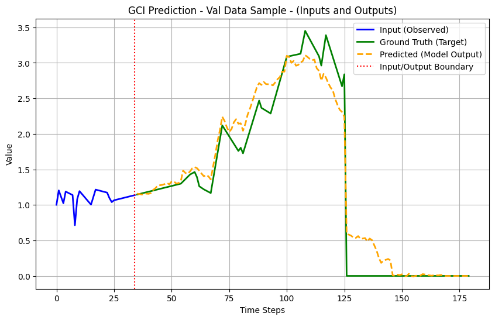

## A reliable method to predict GCI trends: 
- Context: An agri field is divided into several grids ~4000. Each grid produces a certain yield. Periodic satellite images of the field provide us with GCI trends. Knowing the past trends (for previous years), we would like to predict the trend for the future(next year).
- Given ~35 days worth of GCI (Green Chlorophyll Index) satellite data, predict the GCI trend for days 36 through 180.
- Agricultural Advantage: Helps in early estimation of crop yield and harvest dates enabling better financial decisions.
- Model: DNN

## Conclusion:
- Predictions roughly map to ground truth till ~90th day, after which we see significant deviations.
- Since the maximum GCI value appears at around the 90th day, the model can safely predict the max GCI and the day on which we can tentatively see max value. This can be used to predict accurate crop yield, grid by grid.

### 1. Regression Test Results

### 2. Training and Validation Loss

### 3. Validation Results

